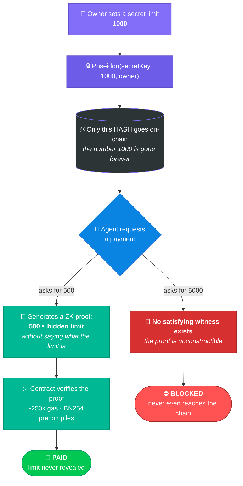

<div align="center">

# 🕶️ Blind Cap

### **Your AI agent proves it can afford a payment — without ever revealing what it's allowed to spend.**

<br/>

[](https://testnet.monadexplorer.com/)
[](https://testnet.monadvision.com/contracts/full_match/10143/0x0693184386bfC020ed22DFD2546cD8ECc3757d9F/)
[](circuits/spend_auth.circom)
[](#-live-deployment)

[](circuits/)
[](contracts/)
[](hardhat.config.js)
[](public/app.js)
[](public/)
[](#-live-deployment)

**Built at Monad Blitz Bangalore V5 · 16 August 2026**

<sub>Product name: **Blind Cap** · on-chain contract name: `ZKSpendAuth` — verified under that name below.</sub>

**[Live Demo](https://blindcap.jmadhan.me) · [Launch App](https://blindcap.jmadhan.me/app) · [Docs](https://blindcap.jmadhan.me/docs) · [Contracts](https://blindcap.jmadhan.me/#contracts)**

</div>

---

> [!IMPORTANT]
> **Every AI agent spend-limit built so far writes the limit on-chain in plain text.**
> This one doesn't. That's the whole idea — and it's the difference between a feature you can demo and one a business can actually deploy.

<br/>

## 💥 The impossible choice everyone else accepts

You give an AI agent a company card. You want a spending limit. But a blockchain is **public forever** — so you get exactly two options:

<div align="center">

| | 🔓 **Write the limit on-chain** | 🚫 **Don't set a limit** |
|:--|:--|:--|
| **Works?** | ✅ Yes | ❌ No |
| **Private?** | ❌ **Everyone reads your budget** | ✅ Yes |
| **What breaks** | Suppliers price to your ceiling · attackers sort agents by cap size · competitors watch your budget move | Prompt-inject the agent, drain the wallet |

</div>

> [!WARNING]
> **Why a public budget is genuinely fatal:** a supplier's agent that can read your buying agent's `10000` cap will *never* quote you `8000` again. Your budget silently becomes the other side's price floor — and you'd never know it happened.

**Nobody should have to pick. Blind Cap refuses to.**

<br/>

## ⚡ What this is

Monad's **ERC-8004 "Trustless Agents"** defines three registries. Two are live. The one that would actually stop a bad payment *before* it happens doesn't exist anywhere yet:

<div align="center">

| Registry | Status | Answers | Acts |
|:--|:--:|:--|:--:|
| 🆔 **Identity** | 🟢 live on mainnet | *who is this agent?* | before |
| ⭐ **Reputation** | 🟢 live on mainnet | *how has it behaved?* | 🕐 **after** |
| 🛡️ **Validation** | 🔴 **missing everywhere** | *is this spend allowed?* | ⚡ **before** |

</div>

Reputation is a post-mortem — it tells you an agent misbehaved *after* your money is gone. **Blind Cap is the missing third registry, and it's privacy-preserving by construction.**

<br/>

## 🪄 How it works

<div align="center">



</div>

### 🔒 Step 1 — Seal the number in an envelope

The limit `1000` goes through a Poseidon hash and comes out as noise:

```
19516529089070200314046734092448919130486296677555044056921542929945353069562
```

**That** goes on-chain. Not the `1000`. It behaves like a sealed envelope — nobody can read what's inside, and *you* can't secretly swap it for a different number later.

> [!NOTE]
> **The `secretKey` isn't decoration — without it the privacy is fake.** Spend limits live in a tiny search space; an attacker would just hash `100, 500, 1000, 5000, 10000…` and match yours in milliseconds. The secret key is the blinding factor that makes the commitment *genuinely* hiding instead of theatrically hiding.

### 🧮 Step 2 — Prove things about the envelope without opening it

The agent produces a Groth16 proof of exactly one statement:

> *"The number sealed in that envelope is **≥** the amount I'm requesting. I'm not telling you what it is. Check my math."*

The contract checks it. The math holds. **Payment approved — and the limit was never revealed to anyone.**

*(Same trick as proving you're over 18 to a bouncer without handing over your birthday, address, and full name.)*

<br/>

## 🔥 The part that makes this different

Ask what happens on an over-limit request. You'd expect *"the contract rejects it."*

**No. Something stronger. It can't even be attempted.**

> [!TIP]
> The proof simply **does not exist**. It isn't rejected — the constraint system has *no satisfying witness*, so proof generation fails on the agent's own machine. It's like being asked to write down a number both larger and smaller than 10. There is nothing to write down.

An over-limit request therefore:

- 🚫 never reaches the chain
- ⛽ costs zero gas
- 🔨 cannot be forged, bribed past, or patched around
- 🧊 is blocked by **mathematics**, not by a rule an admin could quietly change

**Verified live against the deployed contracts:**

<div align="center">

| Requested | Hidden limit | Result | Where it was decided |
|:--:|:--:|:--|:--|
| `500` | `1000` | ✅ **verified on-chain** | live contract, real proof |
| `1000` | `1000` | ✅ **verified on-chain** | exact boundary — inclusive |
| `1001` | `1000` | ⛔ **blocked** | one over — no witness exists |
| `5000` | `1000` | ⛔ **blocked** | never left the browser |

</div>

<br/>

## 🎯 Break it if you can

The contracts below are live and the limit is hidden. **You have everything an attacker would have.**

Try to authorize a spend above the committed limit. You can read every byte of on-chain state, the full circuit, the verifying key, and the contract source. What you *cannot* do is produce a proof — because one doesn't exist.

**That's not a policy. That's the shape of the math.**

<br/>

## 🚀 Try it — under a minute, zero setup

**🔗 Live demo: https://blindcap.jmadhan.me** — nothing to install, just a wallet.

Or run it locally. Everything is **pre-built and pre-deployed** — no circuit to compile, no contract to deploy, no `.env` to touch:

```bash
git clone https://github.com/JMadhan1/Monad_blitz.git
cd Monad_blitz
npm install
npx serve public
```

Open the printed local URL — that's the landing page. Click **Launch App** (or go straight to `/app`) to reach the actual console. Connect MetaMask with a little [testnet MON 🚰](https://faucet.monad.xyz) *(MetaMask will offer to add Monad Testnet automatically)*, then:

<div align="center">

| | Click | What actually happens |
|:--:|:--|:--|
| 1️⃣ | **Type your own limit, then Register Agent + Hide My Limit** | Commits `Poseidon(secretKey, yourLimit, yourAddress)`. Whatever number you typed never leaves your browser. |
| 2️⃣ | **Try — (within limit)** | Amount auto-scales to half your chosen limit. Real proof generated in-browser, verified on-chain, live. ✅ **Passes** |
| 3️⃣ | **Try — (over limit)** | Amount auto-scales to 5× your chosen limit. No proof can be generated. ⛔ **Blocked before it touches the chain** |
| 4️⃣ | **Run Agent Demo** | An autonomous agent makes its own spend decisions against your hidden limit — no clicking required. |

</div>

> [!NOTE]
> Every button is a **real transaction against the live contracts below**. Nothing here is mocked, staged, or simulated.

<br/>

## 🌐 Live deployment

<div align="center">

**Monad Testnet · Chain ID `10143`**

| Contract | Address | Source |
|:--|:--|:--:|
| 🛡️ **ZKSpendAuth** *(main registry)* | `0x0693184386bfC020ed22DFD2546cD8ECc3757d9F` | [](https://testnet.monadvision.com/contracts/full_match/10143/0x0693184386bfC020ed22DFD2546cD8ECc3757d9F/) |
| 🧮 **Groth16Verifier** | `0x4dE6AF7329E88F08C0560DAf1290a0DF152901E3` | [](https://testnet.monadvision.com/contracts/full_match/10143/0x4dE6AF7329E88F08C0560DAf1290a0DF152901E3/) |
| 🆔 **MockIdentityRegistry** | `0x2274D05C24527D0e4b689b215ddEAfE51B319008` | [](https://testnet.monadvision.com/contracts/full_match/10143/0x2274D05C24527D0e4b689b215ddEAfE51B319008/) |

All three **full-match verified** on Sourcify — source, not just bytecode.

</div>

<br/>

<div align="center">

**Monad Mainnet · Chain ID `143`**

| Contract | Address | Source |
|:--|:--|:--:|
| 🛡️ **ZKSpendAuth** *(main registry)* | `0x165825Bd33c87c8aE31d60211dE9EE93e8039adE` | [](https://monadscan.com/address/0x165825Bd33c87c8aE31d60211dE9EE93e8039adE) |
| 🧮 **Groth16Verifier** | `0x4dE6AF7329E88F08C0560DAf1290a0DF152901E3` | [](https://monadscan.com/address/0x4dE6AF7329E88F08C0560DAf1290a0DF152901E3) |
| 🆔 **MockIdentityRegistry** | `0x2274D05C24527D0e4b689b215ddEAfE51B319008` | [](https://monadscan.com/address/0x2274D05C24527D0e4b689b215ddEAfE51B319008) |

Also deployed and **full-match verified** on mainnet. The live demo above runs on testnet (that's where the funded demo wallet and the actual pitch flow live) — mainnet deployment exists to prove the contracts are real and deployable with real value at stake, not just a testnet-only toy.

</div>

<br/>

## 🥊 How this beats what already exists

<div align="center">

| Approach | How it works | ❌ Where it breaks | ✅ Blind Cap |
|:--|:--|:--|:--|
| 👥 **Multisig / human approval** | humans sign each payment | kills autonomy — machine-speed commerce dies at human latency | fully automatic, no human in the loop |
| 🔑 **Session keys** *(ERC-4337)* | scoped key with a spend cap | **cap is a public number on-chain** | only a hash on-chain |
| 💳 **ERC-20 allowance** | `approve(spender, amount)` | public, and no policy or agent model | committed, hidden, agent-scoped |
| ☁️ **Off-chain policy engine** | your backend enforces limits | centralized — nobody can verify you checked | anyone can verify the proof |
| ⭐ **Reputation registry** | rates agents on past behavior | acts *after* the money is gone | gates *before* the spend |

</div>

**Prior art check — measured, not guessed:** queried the Monad Blitz showcase API across **1,400+ past projects**. The closest match enforces agent spend caps via session keys — with the cap as a **plain visible number on-chain**. Every comparable project does the same.

**Nobody hides the policy itself.**

<br/>

<details>
<summary><b>🔬 The security detail most people miss — click to expand</b></summary>

<br/>

A natural attack on this design: *generate a valid proof against a **different** policy, then submit it.*

That's closed. In [`ZKSpendAuth.sol`](contracts/ZKSpendAuth.sol), the contract assembles the public signals **itself** — the caller never supplies them:

```solidity
uint256 committedRoot = policyCommitment[req.agentId];                        // from storage
uint256 ownerAddr = uint256(uint160(identityRegistry.ownerOf(req.agentId)));  // from the registry
uint[3] memory publicSignals = [committedRoot, req.requestedAmount, ownerAddr];

bool ok = verifier.verifyProof(pA, pB, pC, publicSignals);
if (!ok) revert InvalidProof();
```

`committedRoot` comes from storage, `requestedAmount` from the recorded on-chain request, and `ownerAddr` from the identity registry — all read at verification time.

**So a prover cannot lie about which policy or which amount their proof covers.** A perfectly valid proof built against any other policy is worthless here. Every failure path reverts without writing state.

</details>

<details>
<summary><b>🧩 The circuit — the whole trust model in ~30 lines</b></summary>

<br/>

[`circuits/spend_auth.circom`](circuits/spend_auth.circom) proves two things at once, with `secretPolicyKey` and `maxLimit` staying **private**:

```circom
// 1. I know the real policy behind that committed hash
component hasher = Poseidon(3);
hasher.inputs[0] <== secretPolicyKey;
hasher.inputs[1] <== maxLimit;
hasher.inputs[2] <== ownerAddr;
hasher.out === committedRoot;

// 2. ...and this request fits inside it
component leq = LessEqThan(limitBits);
leq.in[0] <== requestedAmount;
leq.in[1] <== maxLimit;
leq.out === 1;
```

Public signals: `committedRoot`, `requestedAmount`, `ownerAddr`.
Private witness: `secretPolicyKey`, `maxLimit`.

**Constraint 2 is the one that can't be satisfied when you overspend** — and that's the entire security story.

</details>

<details>
<summary><b>🤔 Why zero-knowledge, and not something simpler?</b></summary>

<br/>

| Alternative | Why it fails |
|:--|:--|
| 🔐 **Encrypt the limit on-chain** | somebody must decrypt to check it — that somebody is now a trusted party |
| 👀 **Hash it, reveal on spend** | reveals it. That was the thing we were avoiding |
| 🖥️ **TEE / secure enclave** | hardware trust assumption, side channels, and you must trust the operator |
| 🧑‍🤝‍🧑 **MPC** | needs an online committee and liveness guarantees — far heavier |

ZK is the only option that is **simultaneously**: no trusted party · no reveal · publicly verifiable · checkable on-chain in a single transaction.

**And why Monad?** Native BN254 pairing precompiles make Groth16 verification cheap (~250k gas) — and agentic payments are high-frequency machine-speed traffic, so per-check cost and latency *are* the whole ballgame. ERC-8004 already lives on Monad mainnet, so this plugs into an ecosystem that exists rather than one you'd have to invent.

</details>

<br/>

## 📁 What's in the repo

```
├── circuits/spend_auth.circom          🧩 the entire trust model, ~30 lines
├── contracts/
│   ├── ZKSpendAuth.sol                 🛡️ registerPolicy · revokePolicy · validationRequest · validationResponse
│   ├── Groth16Verifier.sol             🧮 snarkjs-generated, BN254 precompiles
│   ├── Upvote.sol                      🗳️ on-chain waitlist counter, one signup per address
│   └── mocks/MockIdentityRegistry.sol  🆔 ERC-8004 Identity Registry stand-in
├── public/                             🎨 static frontend — proofs generated in YOUR browser
│   ├── index.html                      🏠 landing page (problem, mechanism, live waitlist counter)
│   ├── app.html                        🖥️ the actual 4-step console (connect → commit → spend → agent demo)
│   ├── docs.html                       📖 full documentation, on-site — not a GitHub redirect
│   ├── agent/simple-agent.js           🤖 the autonomous demo agent
│   └── vercel.json                     ▲ zero-build static deploy config (deploy root is public/)
├── scripts/                            deploy.js · deploy-mainnet.js · deploy-upvote.js · redeploy-registry.js
└── test/                               ✅ ZKSpendAuth.test.js + Upvote.test.js
```

```bash
npx hardhat test   # 4 passing
```

<br/>

## ⚖️ Honest limitations

Built in a single-day hackathon window. These are the corners **knowingly** cut — and exactly what closes each one.

<div align="center">

| Limitation | Why it's there | What fixes it |
|:--|:--|:--|
| 🔁 **Per-transaction cap, not a running budget** | no cumulative spend tracking — an agent can spend `500` repeatedly | commit a running total; prove `spent + amount ≤ limit` and commit the new `spent` |
| 1️⃣ One flat limit per agent | no per-recipient or time-windowed budgets | a Merkle-root policy instead of a single hash |
| 🎪 Single-contributor trusted setup | time-boxed for today's window | multi-party ceremony, or a setup-free system (Plonk/Halo2) before real money |
| ⏱️ In-browser proving (~1–2s) | fine for a demo, too slow at high agent throughput | server-side or cached proving |
| 🆔 `MockIdentityRegistry` stands in | no real ERC-8004 Identity Registry on testnet yet | swap in the real one once it ships |

</div>

> [!CAUTION]
> **Precision on the privacy claim:** `requestedAmount` is **public**. Blind Cap hides the *policy*, not the *payment*. Observers can see what's being spent — they can never see what's **allowed**. That's the intended tradeoff, and stating it plainly is what makes the rest of the claim credible.

<br/>

## ▲ Deploying the frontend

The frontend is fully static — [`public/vercel.json`](public/vercel.json) pins a zero-build deploy that skips the Hardhat/circom toolchain entirely and ships `public/` as-is.

```bash
npm install -g vercel
vercel --prod
```

Or import the GitHub repo at [vercel.com/new](https://vercel.com/new) — the config is committed, so it deploys with no settings to fill in.

<details>
<summary><b>🛠️ Deploying your own contracts</b></summary>

<br/>

Only needed if you want fresh contracts under your own key, rather than pointing at the deployment above.

```bash
# 1. rebuild circuit + trusted setup (already built & committed — skip unless you changed the circuit)
./circom.exe circuits/spend_auth.circom --r1cs --wasm --sym -o circuits/build -l node_modules

# 2. add a deployer key
echo "DEPLOYER_PRIVATE_KEY=0x..." > .env

# 3. deploy — writes deployment.json to the repo root AND public/,
#    so the frontend picks up your fresh addresses automatically
npx hardhat run scripts/deploy.js --network monadTestnet

# 4. verify on Sourcify (already configured in hardhat.config.js)
npx hardhat verify --network monadTestnet <GROTH16_VERIFIER_ADDRESS>
npx hardhat verify --network monadTestnet <IDENTITY_REGISTRY_ADDRESS>
npx hardhat verify --network monadTestnet <ZKSPENDAUTH_ADDRESS> <VERIFIER_ADDRESS> <IDENTITY_REGISTRY_ADDRESS>
```

</details>

<br/>

## 🧰 Tech stack

<div align="center">

**Circom 2** + **snarkjs** *(Groth16, BN254)* · **Solidity 0.8.24** + **Hardhat** · **ethers.js v6**

Vanilla JS/HTML/CSS frontend — **zero framework, zero build step**, so anyone can run it with nothing but Node installed.

<br/>

---

<br/>

### 🕶️ Blind Cap — privacy-preserving compliance for agentic payments

*Not just compliance you can see. Compliance you can't.*

<br/>

**Monad Blitz Bangalore V5** · 16 August 2026

</div>
